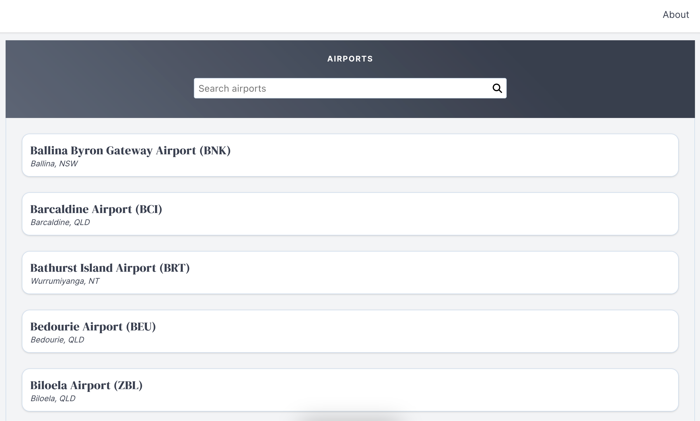
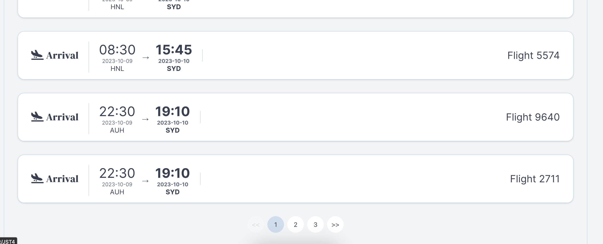

# Flightsein

A simple app written in Vue.js that allows searching for Australian Airports & Flights.
A great opportunity to have learnt some Vue!





## Setup

### Install npm packages
```
npm install
```

### Compile and run the server on http://localhost:8080
```
npm run serve
```
